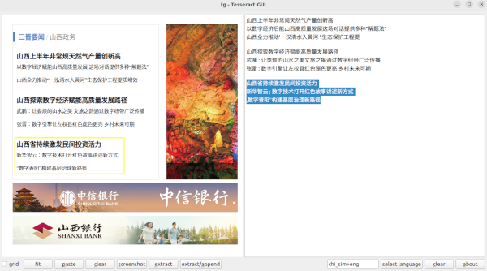

# tg - Tesseract GUI

### tg is an OCR program which extracts text from screenshots or scanned pages

### Tested Linux Distributions: 
- Ubuntu 22.04, 
- Ubuntu 24.04 
- Debian 6.1.128-1 

### written in C++ 20, make use of Qt6 and tesseract libs

### dependencies
- tesseract ( version 4 or 5 )
- tesseract libs
- qt6 libs
- g++ compiler 11.4 or higher
- cmake 3.10 or higher

### Supported Display protocols
- X11
- Wayland 

If linux make use of wayland we need 'gnome-screenshot'  
<b> sudo apt-get install gnome-screenshot</b>

### apt-get

- sudo apt install qt6-base-dev
- sudo apt install tesseract-ocr
- sudo apt install tesseract-ocr-deu tesseract-ocr-eng
- sudo apt install tesseract-ocr-chi-sim
- sudo apt install tesseract-ocr-jpn

